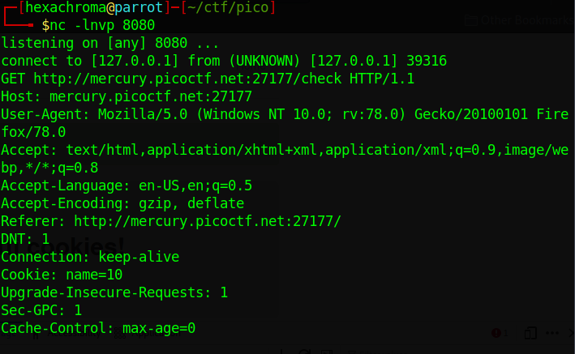

# Cookies (Bruteforcing Cookie id tag)
### by hexachroma
1. Capture HTTP Req with netcat
> 
2. Craft Curl Get request with `Cookie : name= $c`
> with curl
 `for ((c=1; c<=20; c++)); do curl -s -H "Cookie: name=$c" http://mercury.picoctf.net:27177/check;done |grep picoCTF`

