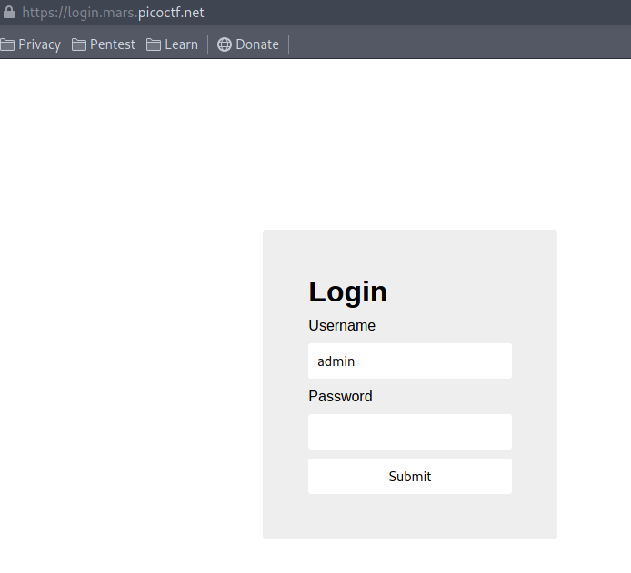
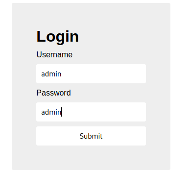
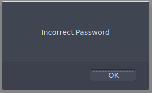
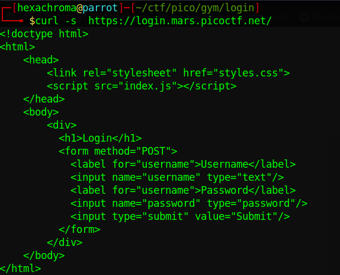
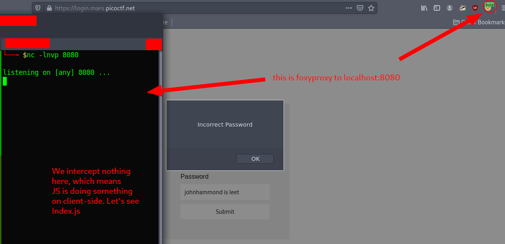
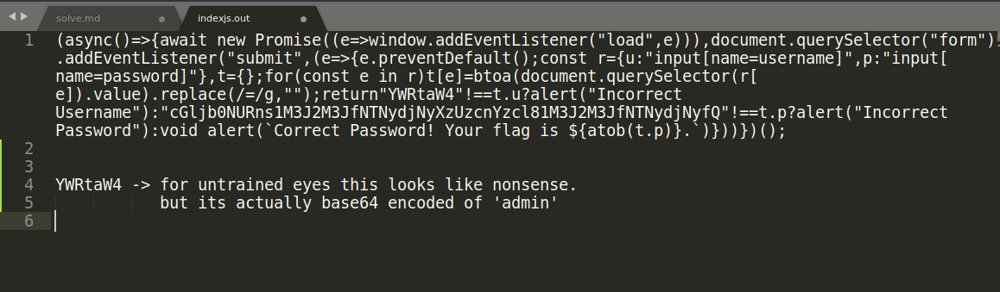

# login (300+ solved webchal)
## by hexachroma

1. Clicking the link brings us to a login page!
> 

2. lets try the stupid `admin:admin` and see if it works
> 

3. We get an error. *surprised picachu face*
> 

4. Stuck? Aww poor thing.. Why don't you see what's under the hood?
> use ctrl+u to read **sourcecode** or `curl -s <uri>`
> 

5. It loads JS? is this some kind of rest application? or something stupid?
> lets intercept our request using foxy proxy to localhost:8080
> 

6. Download index.js with `curl -s <url/index.js> -o indexjs.out`
> 

7. b64decode password from index.js

***done***